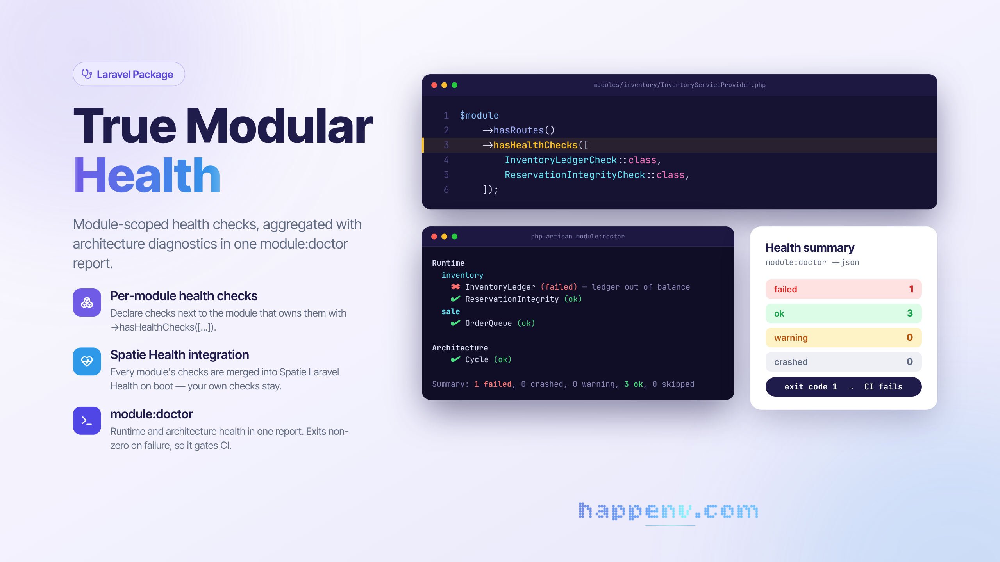

# Health for Laravel True Modular

<div class="filament-hidden">



</div>

[](https://packagist.org/packages/happenv-com/laravel-true-modular-health)
[](https://packagist.org/packages/happenv-com/laravel-true-modular-health)

A companion to [laravel-true-modular](https://github.com/happenv-com/laravel-true-modular) that lets each
module **declare its own health checks**, registers them into
[Spatie Laravel Health](https://github.com/spatie/laravel-health), and adds a `module:doctor` command
that aggregates **runtime** health (the module checks) with **architecture** health (dependency-cycle
detection) in one report.

## Why

The core package gives every module a persistent capability record (the module manifest). This package
reads that manifest, so health checks live next to the module that owns them instead of in one central
list:

```php
$module
    ->hasRoutes()
    ->hasHealthChecks([
        InventoryLedgerCheck::class,
        ReservationIntegrityCheck::class,
    ]);
```

`InventoryLedgerCheck` is a plain Spatie `Check` (`Spatie\Health\Checks\Check`). The core stores only the
class name; this package validates and instantiates it.

## Install

```bash
composer require happenv-com/laravel-true-modular-health
```

It auto-discovers. On boot it merges every module's declared checks into Spatie Health (preserving any
checks you registered yourself), so your existing `health:check` command, scheduled run, and dashboard
include them automatically.

## `module:doctor`

```bash
php artisan module:doctor                 # runtime + architecture
php artisan module:doctor --module=inventory   # runtime checks for one module (architecture still runs)
php artisan module:doctor --json          # machine-readable
```

The command exits non-zero when any check is `failed` or `crashed`, so it doubles as a CI gate. JSON
output carries a stable envelope:

```json
{
    "schema": { "name": "doctor", "version": 1 },
    "summary": { "ok": 2, "warning": 0, "failed": 1, "crashed": 0, "skipped": 0 },
    "modules": {
        "inventory": [
            { "check": "InventoryLedger", "status": "failed", "message": "..." }
        ],
        "architecture": [
            { "check": "Cycle", "status": "ok", "message": null }
        ]
    }
}
```

## Architecture checks

`Cycle` (`Happenv\LaravelTrueModular\Health\Architecture\CycleCheck`) fails when the module dependency
graph contains a circular dependency. It reuses the core's own topological sort, so it sees the same
edges the framework uses to order providers.

## License

MIT.
